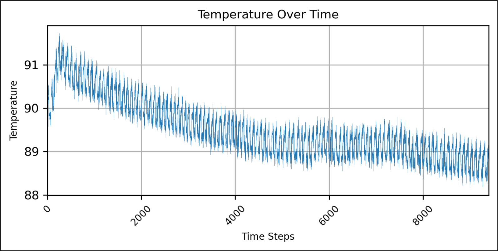
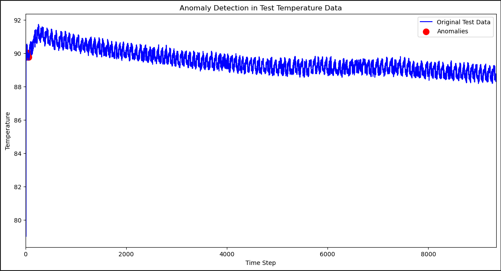
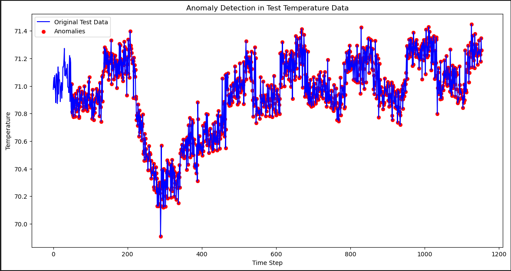

# Final Project
AI Bootcamp Final Project

## Project Overview
This repository contains the code and documentation for my AI Bootcamp Final Project, where I applied Autoencoder to detect anomaly in machines operation based on it's temperature.

### Training dataset

### Testing 1 Sample

### Testing 2 Sample

## Model Summary
- Encoder Layer:
  * Dense Layer (sequence_length, 128) with ReLU
  * Dense Layer (128, 64) with ReLU
  * Dense Layer (64, 32) with ReLU
- Decoder Layer:
  * Dense Layer (32, 64) with ReLU
  * Dense Layer (64, 128) with ReLU
  * Dense Layer (128, sequence_length) with Sigmoid

## Results
After training the model for 15 epochs, the performance is as follows:
- Loss: 0.0020
